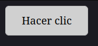

# HTML y accesibilidad

La accesibilidad del contenido web se puede mejorar mucho simplemente usando correctamente los elementos HTML.

Usar correctamente un elemento HTML es utilizarlo de acuerdo al propósito con el que fue creado.

¿Por qué no usar simplemente CSS y JavaScript? De esta forma podemos hacer que cualquier elemento se vea y comporte como queremos. Por ejemplo, el siguiente fragmento muestra un elemento `div` que se ve como un botón:

```html
<!DOCTYPE html>
<html>
<head>
<style>
  .btn {
    display: inline-block;
    padding: 10px 24px;
    background: #e0e0e0;
    border: 1px solid #bbb;
    border-radius: 6px;
    cursor: pointer;
    user-select: none;
  }
  .btn:hover { background: #d0d0d0; }
  .btn:active { transform: scale(0.97); }
</style>
</head>
<body>
  <div class="btn">Hacer clic</div>
</body>
</html>
```



Pero aunque se vea y sienta como tal, el elemento div no es un botón. En su lugar, lo que debería hacerse es utilizar el elemento HTML `<button>`:

```html
<!DOCTYPE html>
<html>
    <body>
        <button type="button">Hacer clic</button>
    </body>
</html>
```

Existen varias razones para hacer esto:

* Los navegadores estilizan en forma predeterminada el elemento `<button>` para que luzca como un botón.
* El elemento `<button>` es alcanzable vía teclado de forma nativa.
* Las tecnologías de asistencia pueden indicar al usuario las acciones posibles y el rol del elemento, así como su estado
* El uso de elementos específicos hace que el código sea más conciso y fácil de trabajar.
* La tarea de buscadores e indexadores se ve facilitada por el uso de elementos específicos porque da un sentido lógico al contenido.

## Semántica Estructural

El botón del ejemplo anterior es un caso de semántica aplicada en HTML, donde usamos el elemento adecuado para la tarea, en este caso `<button>`. El uso correcto de los elementos también ayuda a dar estructura al documento.

### Estructura del Texto

Estructurar bien el texto es crucial para el uso del contenido mediante lectores de pantalla. Para esto es vital utilizar bien los contenedores de texto: encabezados, párrafos, listas, entre otros:

```html
<h1>Título</h1>
<p>Primer párrafo</p>
<p>Segundo párrafo</p>
<h2>Título de sección</h2>
<p>Párrafo de la sección</p>
<ol>
    <li>1er item de la lista</li>
    <li>2do item de la lista</li>
</ol>
```

Una estructura como esta facilita el uso del lector de pantalla puesto que:

* El asistente tiene en cuenta los encabezados para encontrar secciones
* El usuario puede escuchar el contenido elemento a elemento y saltar entre secciones
* Los encabezados pueden usarse para armar un índice, de modo que el usuario pueda elegir una sección cualquiera por donde continuar

En lugar de esto, se podrían haber utilizado elementos genéricos estilizados que --a la vista-- se ven iguales a los elementos específicos, solo para arruinar completamente la experiencia de una persona no vidente.

Como una ventaja adicional, usar elementos más específicos hace que sea más sencillo estilizar con CSS o manipular los elementos vía JavaScript.

### Estructura del Documento

En la sección anterior tratamos sobre la estructura del texto y los elementos HTML que nos permiten definirla. Ahora bien, el texto se inserta en un documento. Y el documento también tiene una estructura. HTML5 cuenta con etiquetas que nos permiten definir secciones dentro del documento. Nuestra tarea como desarrolladores es lograr que la estructura del documento tenga sentido lógico. Por ejemplo:

```html
<!DOCTYPE html>
<html lang="es">
<head>
    <meta charset="UTF-8">
    <title>Ejemplo</title>
</head>
<body>

  <header>
    <h1>Mi sitio web</h1>
  </header>

  <nav>
    <a href="#">Inicio</a>
    <a href="#">Blog</a>
    <a href="#">Contacto</a>
  </nav>

  <search>
    <form action="/buscar.php">
        <label for="buscador">Término de Búsqueda</label>
        <input id="buscador" type="text" name="query">
        <button type="submit">Buscar</button>
    </form>
  </search>

  <main>
    <section>
      <h2>Últimas entradas</h2>
      <article>
        <h3>Título del artículo</h3>
        <p>Contenido autocontenido y redistribuible.</p>
      </article>
    </section>

    <section>
      <h2>Destacados</h2>
      <p>Otra sección temática.</p>
    </section>
  </main>

  <aside>
    <p>Contenido relacionado o complementario.</p>
  </aside>

  <footer>
    <p>© 2026 Mi sitio</p>
  </footer>

</body>
</html>
```

En este ejemplo se puede ver:

* Uso de los elementos `<header>` y `<footer>` para marcar encabezado y pie de página, respectivamente.
* Elemento `<nav>` para enmarcar los vínculos a otras páginas del sitio
* Uso de `<search>` para enmarcar el formulario de búsqueda
* Uso del elemento `<main>` para indicar cuál es el contenido principal de la página.
* Los elementos `<section>` distinguen con claridad las secciones dentro del contenido principal. Cada sección tiene un encabezado seguido de contenido.
* El elemento `<article>` se utiliza para enmarcar contenido redistribuible, que tiene sentido fuera del sitio actual.
* Uso de `<aside>` para enmarcar contenido indirectamente relacionado con el contenido principal.

De esta manera, se brinda información adicional para que las herramientas de asistencia pueden guíar mejor al usuario a través del contenido.

### Tablas

Al definir tablas se debe tener cuidado en dejar establecido cómo se relacionan filas y columnas para formar elementos de datos. Para lograrlo debemos usar correctamente las etiquetas de encabezado:

```html
<table>
  <thead>
    <tr>
      <th scope="col">Etiqueta</th>
      <th scope="col">Descripción</th>
  </thead>
  <tbody>
    <tr>
      <td>th</td>
      <td>Celda de encabezado</td>
    </tr>
    <tr>
      <td>td</td>
      <td>Celda de datos</td>
    </tr>
  </tbody>
  <caption>Etiquetas HTML para definición de tablas</caption>
</table>
```

En el ejemplo, definimos la tabla para tener un encabezado y una sección de datos y hemos utilizado elementos `<th>` para declarar el encabezamiento correspondiente a cada elemento de datos. Además, dejamos establecido que este encabezamiento es propio de cada columna, a través del atributo `scope`. De esta manera, se logra agrupar los datos en unidades para cada fila, facilitando su acceso mediante lectores de pantalla.

También se muestra el uso de la etiqueta `<caption>`, que sirve para agregar un descripción o resumen del contenido de la tabla. Esta descripción es utilizada por lectores de pantalla y es visible también para el usuario vidente. Si no se desea que el texto sea visible, puede utilizarse el atributo `summary` del elemento `<table>`:

```html
<table summary="Etiquetas HTML para definición de tablas">...</table>
```

## Elementos Interactivos

Usar elementos estándar es vital cuando se trata de elementos interactivos, porque los navegadores proveen formas nativas de interacción que incluyen manipulación vía teclado, así como la estilización necesaria para señalar los elementos manipulables y dar pistas sobre su estado actual, sin que tengamos que programar por nuestra cuenta.

### Manipulación por Teclado

Tomando parte del ejemplo anterior de estructura:

```html
<nav>
  <a href="#">Inicio</a>
  <a href="#">Blog</a>
  <a href="#">Contacto</a>
</nav>
```

En este ejemplo podemos ver que, sin agregar nada, los links del `<nav>` y los controles del formulario de búsqueda se pueden enfocar y activar usando el tabulador y la barra espaciadora, respectivamente.

Esto es especialmente útil para los usuarios que no pueden usar un mouse, pero también facilita el uso de lectores de pantalla, que pueden conocer el rol y estado de cada objeto interactivo y transmitir esta información al usuario no vidente, permitiendo que interactúe con ellos.

En el caso (raro) de que no encontremos un elemento nativo que satisfaga nuestras necesidades, podemos emular este comportamiento con los atributos `tabindex` y `role`, junto con algo de JavaScript, como se muestra en el siguiente ejemplo, adaptado de [HTML: A good basis for accessibility - Learn web development | MDN](https://developer.mozilla.org/en-US/docs/Learn_web_development/Core/Accessibility/HTML#good_semantics)

```html
<body>
  <div data-message="This is from the first button" tabindex="0" role="button">
    Click me!
  </div>
  <div data-message="This is from the second button" tabindex="0" role="button">
    Click me too!
  </div>
  <div data-message="This is from the third button" tabindex="0" role="button">
    And me!
  </div>
  <script>
    document.onkeydown = (e) => {
      // The Enter/Return key
      if (e.key === "Enter") {
        document.activeElement.click();
      }
    };
  </script>
</body>
```

Aquí podemos ver el uso de un elemento genérico `<div>`, con el atributo `tabindex` tomando valor `0` para hacer que el elemento sea enfocable a través del teclado. También se observa que el atributo `role` toma el valor `button` para indicar a la tecnología de asistencia que se trata de un botón. El fragmento JavaScript agrega un callback para simular un click sobre el elemento cuando se presiona la tecla "Enter" sobre él y de esta manera poder activarlo.

El propósito del ejemplo es dual: nos permite ver la potencia de HTML en combinación con JavaScript para crear experiencias interactivas personalizadas, pero también sirve para ilustrar la complejidad de esta tarea; hubiera sido mejor utilizar elementos `<button>` en primer lugar, puesto que ya tienen esta experiencia incorporada en todos los navegadores.

### Controles de formulario

Cuando usamos controles nativos también tenemos manipulación por teclado incluida. Un elemento adicional a considerar en formularios es el correcto etiquetado de los controles:

```html
<search>
  <form action="/buscar.php">
    <label for="buscador">Término de Búsqueda</label>
    <input id="buscador" type="text" name="query">
    <button type="submit">Buscar</button>
  </form>
</search>
```

En el ejemplo podemos ver que el control de texto tiene una etiqueta asociada a través de su ID. Los lectores de pantalla pueden usar esta asociación para describir correctamente el control, de modo que el usuario comprenda el propósito del campo.

### Links

#### Estilo

Los links poseen estilo por defecto en todos los navegadores, que comunica el rol de una porción de texto para indicar que, efectivamente, se trata de un link. Normalmente, esto consiste en subrayar el texto y colorearlo en azul cuando se trata de un link no visitado y en púrpura en los casos en que ya se visitó. Además, presenta bordes cuando está enfocado. Cuando se estilizan los links usando CSS se debe tener en cuenta estas diferenciaciones, a fin de que no se pierda la información de estado para el usuario vidente:

* Los links deben contrastar claramente con el resto del texto
* Cada estado posible del link debe distinguirse claramente
* Tiene que haber buen contraste con repecto al fondo
* No debemos usar el color como elemento distintivo en forma exclusiva

#### Pseudo-botones

Muchas veces se utilizan links para simular botones, poniendo el atributo `href` en `#` o `javascript:void(0)` y utilizando el evento `click` vía JavaScript. Esto se considera una mala práctica y debe evitarse siempre, favoreciendo el uso de `<button>` en lugar de `<a>`. Algunos de los problemas que causan los pseudo-botones:

* Los lectores de pantalla no los reconocen correctamente
* No permiten copiar el link o agregar a marcadores
* No permiten abrir el contenido en otra pestaña o ventana
* No funcionan sin JavaScript, si hay un error o si el script aún no se cargó

#### Links externos

Se debe incluir algo que indique lo que va a ocurrir cuando el link se active. En caso de que sea un ícono, se debe incluir texto alternativo.

```html
<a href="/about.html" target="_blank">
  
  Acerca de
</a>
```

En lo posible debería evitarse abrir nuevas pestañas o ventanas ya que puede confundir a los usuarios de lectores de pantalla. Algunos lectores de pantalla podrían no indicar el cambio de contexto.

#### Skip Links

Un "skip link" es un link que permite a los usuarios saltar al contenido principal en forma directa sin tener que atravesar una larga lista de links u otros elementos. Se recomienda agregar enlaces de este tipo para ayudar a los usuarios de lectores de pantalla así como a aquellos que solo pueden utilizar teclado:

```html
<body>
  <a href="#principal">Saltar al contenido principal</a>
  ...
  <main id="principal">
    ...
  </main>
</body>
```

El truco del skip link es ponerlo lo más arriba posible en el fuente para que el usuario lo encuentre rápidamente.

## Contenido Multimedia

El tratamiento de contenido multimedia presenta algunas particularidades, puesto que la personas no-videntes no pueden ver imágenes o video y las personas sordas no pueden escuchar audio. Esto implica que debemos proveer alternativas siempre que las imágenes, videos o audios sean importantes para entender el contenido presentado.

### Imágenes

Siempre debemos proveer texto alternativo para las imágenes usando el atributo `alt`. Algunos lectores de pantalla indican el nombre de archivo, en caso de que no haya un texto alternativo; por esta razón, es conveniente dar nombres de archivo significantes. Si la imagen es solo decorativa, debemos agregar el atributo `alt` vacío:

```html


```
También es útil agregar información usando el atributo `title`, para el cual además los navegadores generan un tooltip:

```html

```
Una posibilidad alternativa es utilizar el texto de otro elemento como descripción de la imagen. Para esto utilizamos el atributo `aria-labelledby` de WAI-ARIA:

```html

<p id="javo-label">Javo: el tiranosaurio frustrado</p>
```
De esta manera los lectores de pantalla utilizarán el texto del párrafo como texto alternativo de la imagen.

Existe aún una posibilidad más utilizando elementos `<figure>` y `<figcaption>`, que resulta semánticamente más clara y facilita la aplicación de estilos:

```html
<figure>
  
  <figcaption id="javo-desc">
    El tiranosaurio Javier frustrado por no poder atar sus cordones
  </figcaption>
</figure>
```

### Audio

Para hacer que el contenido de audio sea accesible para personas sordas, debemos proveer transcripciones. En este caso, no tenemos una forma estándar de proveer transcripciones a partir de, por ejemplo, el reproductor embebido. Sin embargo, podemos incluirlas en la misma página donde se encuentra el audio o proveer un link para acceder a ella:

```html
<figure>
  <audio controls aria-labelledby="javo-desc">
    <source src="javo.mp3" type="audio/mpeg">
    <source src="javo.ogg" type="audio/ogg">
    <p>
      Download <a href="javo.mp3">MP3</a> or
      <a href="javo.ogg" download="javo.ogg">OGG</a> audio.
    </p>
  </audio>
  <figcaption id="javo-desc">
    Javo el Tiranosaurio cargando contra periodisaurios por no poder atarse los cordones. Acceda a la <a href="javo-transcript.html">transcripción</a>
  </figcaption>
</figure>
```

### Video

HTML5 permite agregar pistas de texto en videos para implementar subtitulado, de esta manera podemos hacer que el video sea accesible para personas sordas, ciegas o que desconocen la lengua que se habla en él. Para hacer esto, disponemos de un elemento `<track>`, que permite cargar subtítulos en formato WebVTT:

```html
<video id="video" controls preload="metadata">
  <source src="/videos/tiranosaurio-short.mp4" type="video/mp4" />
  <source src="/videos/tiranosaurio-short.webm" type="video/webm" />
  <track
    label="English"
    kind="subtitles"
    srclang="en"
    src="/misc/tiranosaurio-en.vtt"
    default />
  <track
    label="Deutsch"
    kind="subtitles"
    srclang="de"
    src="/misc/tiranosaurio-de.vtt" />
  <track
    label="Español"
    kind="subtitles"
    srclang="es"
    src="/misc/tiranosaurio-es.vtt" />
</video>
```

Como se ve en el ejemplo, cada pista tiene una etiqueta (`label`) y un tipo (`kind`) e indica el idioma (`srclang`) del subtítulo, así como la URL desde donde cargarlo (`src`).

Agregar pistas de texto también es beneficio para el posicionamiento en buscadores, ya que los indexadores procesan el texto de los subtítulos.
