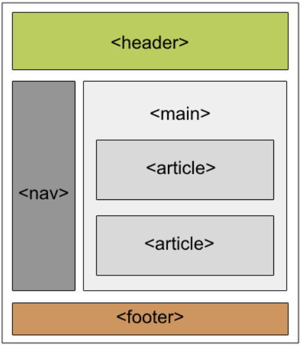

<!-- _class: lead -->

# Código Accesible en HTML5, JavaScript y hojas de estilo

---

## DEU/DCU 2026 - Facultad de Informática - UNLP

<div class="align-center">

### Grupo 9

* Juan Cruz Cassera Botta
* Agustin Ferreyra
* Ignacio Esteban Hurtado Cabbad

</div>

---

## ¿Por qué usar HTML Semántico?

<div class="columns">
<div>

El uso correcto de los elementos HTML adecuados de acuerdo a su propósito ayuda a dar una estructura y significado lógicos a los documentos web

### Beneficios
* Estilización nativa predeterminada
* Alcanzable vía teclado de forma automática
* Roles claros expuestos a lectores de pantalla

</div>
<div>


</div>
</div>

---

<!-- _class: lead -->

# Semántica Estructural

---

## Estructura del Texto

Estructurar bien el texto es crucial para lectores de pantalla. Es vital usar correctamente los contenedores específicos: encabezados, párrafos y listas (`<h1>`-`<h6>`, `<p>`, `<ol>`, `<ul>`)

<div class="columns">
<div>

```html
<h1>Título</h1>
<p>Primer párrafo</p>
<p>Segundo párrafo</p>
<h2>Título de sección</h2>
<p>Párrafo de la sección</p>
<ol>
    <li>1er item de la lista</li>
    <li>2do item de la lista</li>
</ol>
```

</div>
<div>

* Permite a los asistentes identificar secciones y saltar entre ellas
* Facilita la navegación al usuario al generar índices automáticos
* Hace más sencillo estilizar con CSS y manipular vía JavaScript

</div>
</div>

---

## Estructura del Documento

<!-- _style: "pre { font-size: 0.35em; margin-top: 0px; padding: 10px; }" -->

HTML5 incluye elementos específicos para definir áreas lógicas dentro de una página web, mejorando la asistencia de navegación.

<div class="columns">
<div>



</div>
<div>

* **`<header>` y `<footer>`**: Encabezado y pie de página del documento o sección.
* **`<nav>`**: Enmarca enlaces de navegación.
* **`<search>`**: Contenedor para formularios de búsqueda.
* **`<main>`**: Indica el contenido principal de la página.
* **`<section>` y `<article>`**: Secciones temáticas y contenidos autocontenidos y reutilizables.
* **`<aside>`**: Contenido indirectamente relacionado o complementario.

</div>
</div>

---

## Estructura del Documento (ejemplo completo)

```html
<!DOCTYPE html>
<html lang="es">
<head>
    <meta charset="UTF-8">
    <title>Ejemplo</title>
</head>
<body>
  <header>
    <h1>Mi sitio web</h1>
  </header>
  <nav>
    <a href="#">Inicio</a>
    <a href="#">Blog</a>
    <a href="#">Contacto</a>
  </nav>
  <search>
    <form action="/buscar.php">
        <label for="buscador">Término de Búsqueda</label>
        <input id="buscador" type="text" name="query">
        <button type="submit">Buscar</button>
    </form>
  </search>
  <main>
    <section>
      <h2>Últimas entradas</h2>
      <article>
        <h3>Título del artículo</h3>
        <p>Contenido autocontenido y redistribuible.</p>
      </article>
    </section>
    <section>
      <h2>Destacados</h2>
      <p>Otra sección temática.</p>
    </section>
  </main>
  <aside>
    <p>Contenido relacionado o complementario.</p>
  </aside>
  <footer>
    <p>© 2026 Mi sitio</p>
  </footer>
</body>
</html>
```

---

<!-- _style: "pre { font-size: 0.45em; margin-top: 0px; padding: 10px; }" -->

## Tablas

Para que las tablas sean accesibles, se debe estructurar claramente cómo se relacionan las filas y columnas para que el asistente pueda agrupar los datos en unidades con sentido lógico.

<div class="columns">
<div>

```html
<table>
  <thead>
    <tr>
      <th scope="col">Etiqueta</th>
      <th scope="col">Descripción</th>
  </thead>
  <tbody>
    <tr>
      <td>th</td>
      <td>Celda de encabezado</td>
    </tr>
  </tbody>
  <caption>Etiquetas HTML para definición de tablas</caption>
</table>
```

</div>
<div>

* Usar `<th>` en lugar de `<td>` para celdas de encabezado.
* Definir si el encabezado aplica a columna, fila o un grupo de ellas, usando el atributo `scope`.
* Añadir una descripción de la tabla usando el elemento `<caption>`.
  * Si no se desea que se muestre el título, se puede usar el atributo `summary` de la `<table>`

</div>
</div>

---

<!-- _class: lead -->

# Elementos Interactivos

---

## Manipulación por Teclado

Siempre que sea posible debemos usar elementos predefinidos. Los elementos interactivos estándar (botones, enlaces, inputs) son accesibles por teclado de forma nativa en todos los navegadores.

<div class="columns">
<div>


```html
<nav>
  <a href="#">Inicio</a>
  <a href="#">Blog</a>
  <a href="#">Contacto</a>
</nav>
```

</div>
<div>

* Los links del ejemplo se pueden enfocar con `Tab` y activar con `Enter` o `Space` automáticamente
* Los navegadores estilizan los elementos para brindar pistas visuales
* La información de foco y estado se presenta a los lectores de pantalla y otras tecnologías

</div>
</div>

---

## Manipulación por Teclado

<!-- _style: "pre { font-size: 0.45em; margin-top: 0px; padding: 10px; }" -->

Cuando no es posible usar elementos nativos, podemos emular este comportamiento con atributos de accesibilidad y JavaScript.

<div class="columns">
<div>

* **`tabindex="0"`**: Hace al elemento genérico enfocable a través del teclado usando `Tab`.
* **`role="button"`**: Indica a la tecnología de asistencia que el elemento se comporta como un botón.
* **JavaScript**: Agrega interacción para responder a la tecla **Enter** simulando un click nativo.


</div>
<div>

```html
<div tabindex="0" role="button" 
     data-message="Click!">
  ¡Click me!
</div>

<script>
  document.onkeydown = (e) => {
    // Tecla Enter
    if (e.key === "Enter") {
      document.activeElement.click();
    }
  };
</script>
```

</div>
</div>

> Aunque esto resalta las posibilidades de JavaScript para generar experiencias interactivas complejas, también incrementa la complejidad y puede ser fuente de errores. Siempre que sea posible, se debe optar por usar elementos nativos.

---

## Controles de formulario

El correcto etiquetado es crucial para que los lectores de pantalla puedan guiar al usuario en la carga de datos. Para esto usamos la etiqueta `<label>` vinculada a su respectivo input a través del atributo `for` y el `id` del control

<div class="columns">
<div>

```html
<form>
  <label for="buscador">Término de Búsqueda</label>
  <input id="buscador" type="text" name="query">
  <button type="submit">Buscar</button>
</form>
```

</div>
<div>

* El lector de pantalla lee la etiqueta del campo cuando el control recibe el foco
* Al activar el elemento `<label>` se enfoca el input asociado

</div>
</div>

---

## Links

### Estilo Visual

Los navegadores estilizan los enlaces por defecto para comunicar su rol de manera intuitiva (subrayado, azul/púrpura, borde de foco).

<div class="columns">
<div>

```css
a {
  color: #2563eb;
  text-decoration: underline;
}
a:visited {
  color: #7c3aed;
}
a:focus {
  outline: 2px solid #3b82f6;
}
```

</div>
<div>

Al aplicar estilos CSS personalizados, mantenga estas pautas esenciales:
* **Contraste**: Los links deben contrastar fuertemente con el fondo y el texto general.
* **Estados**: Cada estado visual (hover, active, focus, visited) debe ser claramente distinguible.
* **Sin Exclusividad**: No depender exclusivamente del color para indicar enlaces (ej: usar subrayados o bordes).

</div>
</div>

---

## Links

### Pseudo-botones

Utilizar enlaces `<a>` para simular botones (poniendo `href="#"` o `href="javascript:void(0)"` y asignando eventos click con JS) es una mala práctica.

<div class="columns">
<div>

```html
<!-- INCORRECTO -->
<a href="#" onclick="guardar()">Guardar</a>

<!-- CORRECTO -->
<button type="button" onclick="guardar()">Guardar</button>
```

</div>
<div>

* Los lectores de pantalla no los reconocen ni anuncian correctamente.
* Impide la apertura en pestaña nueva (clic central), copiar el enlace o añadir a marcadores.
* Deja de funcionar ante retrasos o errores en la carga de JavaScript.

</div>
</div>

> Se debe usar `<button>` para acciones de la app y `<a>` solo para cambiar de página/sección.

---

## Links

### Enlaces Externos

Cuando un enlace se configura para abrir en una pestaña o ventana nueva, es imprescindible indicarlo de antemano.

<div class="columns">
<div>

```html
<a href="/about.html" target="_blank">
  
  Acerca de
</a>
```

</div>
<div>

* Se puede usar un ícono para indicar este comportamiento.
  * Se debe incluir un texto alternativo con el atributo `alt`.
* Abrir nuevas pestañas de forma repentina puede desorientar a los usuarios de lectores de pantalla.

</div>
</div>

> Se debe evitar a menos que sea estrictamente necesario.

---

## Links

### Skip Links (enlaces de salto)

Un "skip link" es un atajo inicial invisible que permite a los usuarios de teclado saltarse menús y barras de navegación largas.

<div class="columns">
<div>

```html
<body>
  <!-- Skip Link al inicio -->
  <a href="#principal">
    Saltar al contenido principal
  </a>
  ...
  <main id="principal">
    <!-- Contenido -->
  </main>
</body>
```

</div>
<div>

* **Agilidad al Teclado**: Evita que un usuario tenga que presionar `Tab` decenas de veces antes de leer el artículo.
* **Posicionamiento**: Debe ubicarse lo más arriba posible del fuente HTML para que sea el primer elemento en recibir foco.

</div>
</div>

---

<!-- _class: lead -->

# Contenido Multimedia

---

## Imágenes

Toda imagen relevante debe contar con una alternativa textual. Disponemos de varias alternativas.

### Atributos `alt` y `title`

<div class="columns">
<div>

```html


```

</div>
<div>

* `alt` provee una descripción larga de la imagen
  * Si no es relevante, debemos usarlo vacío
* En caso de que no esté presente, los lectores indican el nombre de archivo.
  * Es conveniente usar nombres de archivo significantes
* `title` provee una descripción corta de la imagen. Los navegadores la muestran como tooltip.

</div>
</div>

---

## Imágenes

### WAI-ARIA / HTML5

<div class="columns">
<div>

```html

<p id="javo-label">Javo: el tiranosaurio frustrado</p>

<figure>
  
  <figcaption id="javo-desc">
    El tiranosaurio Javier frustrado por no poder atar sus cordones
  </figcaption>
</figure>
```

</div>
<div>

* Con `aria-labelledby`, el lector de pantalla lee el texto del elemento referenciado.

* Cuando la imagen está acompañada de un caption, es preferible usar el elemento `<figure>` junto a `<figcaption>`. En ese caso, el caption sirve como descripción de la imagen.
  * Igualmente se usa `aria-labelledby` para el caso en que el caption no sea soportado por el navegador.

</div>
</div>

---

## Audio

El contenido de audio requiere alternativas textuales (transcripciones) para personas con dificultades auditivas.

En caso de que el navegador no sea compatible con el elemento `<audio>`, se debe proporcionar un enlace para descargar el archivo.

```html
<figure>
  <audio controls aria-labelledby="javo-desc">
    <source src="javo.mp3" type="audio/mpeg">
    <source src="javo.ogg" type="audio/ogg">
    <p>
      Descargar el audio en <a href="javo.mp3">MP3</a> o
      <a href="javo.ogg" download="javo.ogg">OGG</a>.
    </p>
  </audio>
  <figcaption id="javo-desc">
    Javo el Tiranosaurio cargando contra periodisaurios por no poder atarse los cordones. Acceda a la <a href="javo-transcript.html">transcripción</a>
  </figcaption>
</figure>
```

---

## Video

El video en HTML5 soporta subtitulado nativo para hacer accesibles las pistas de audio a personas sordas o que no comprenden el idioma.

<div class="columns">
<div>

```html
<video id="video" controls preload="metadata">
  <source src="/videos/tiranosaurio-short.mp4" type="video/mp4" />
  <source src="/videos/tiranosaurio-short.webm" type="video/webm" />
  <track
    label="English"
    kind="subtitles"
    srclang="en"
    src="/misc/tiranosaurio-en.vtt"
    default />
  <track
    label="Deutsch"
    kind="subtitles"
    srclang="de"
    src="/misc/tiranosaurio-de.vtt" />
  <track
    label="Español"
    kind="subtitles"
    srclang="es"
    src="/misc/tiranosaurio-es.vtt" />
</video>
```
</div>
<div>

* Elemento `<track>` permite cargar pistas en formato **WebVTT** (`.vtt`).
* Los atributos del elemento `<track>` son:
  * `kind`: Tipo de pista
  * `label`: Nombre de la opción
  * `srclang`: Código de idioma
  * `default`: Pista activa por defecto
* Como beneficio adicional, los indexadores pueden rastrear y procesar el texto de los subtítulos
  * Mejora el posicionamiento en buscadores

</div>

</div>

---

<!-- _class: lead -->

# ¡GRACIAS!

---

# Referencias

- https://developer.mozilla.org/en-US/docs/Learn_web_development/Core/Accessibility/What_is_accessibility
- https://developer.mozilla.org/en-US/docs/Learn_web_development/Core/Accessibility/HTML
- https://developer.mozilla.org/en-US/docs/Learn_web_development/Core/Accessibility/CSS_and_JavaScript
- https://www.w3.org/WAI/fundamentals/accessibility-intro/